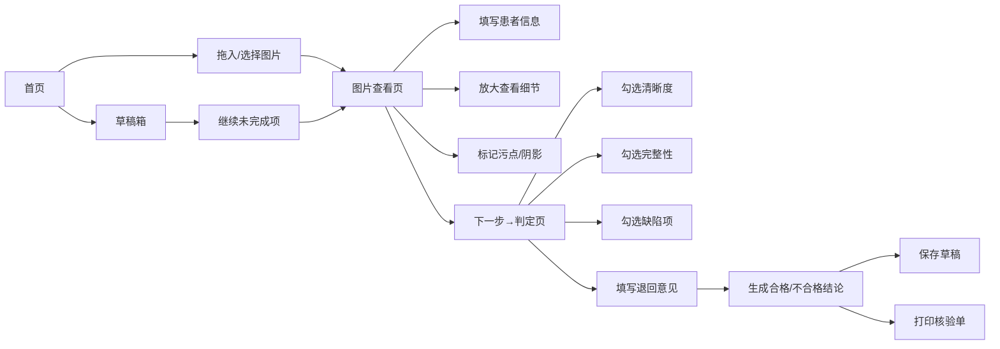

## 1. 产品概述

医疗胶片数字件质控核查系统，为夜班值班医生、轮转技师和质控老师提供轻量级、免登录的纯前端浏览器核查工具。无需复杂系统集成，打开浏览器即可对单个胶片数字件进行快速质量判定，支持本地图片拖入、焦点放大、缺陷标记、结论生成和草稿持久化。

- **核心价值**：解决临时借用电脑、夜班应急场景下的胶片质控需求，避免复杂系统登录流程
- **目标用户**：夜班值班医生、轮转技师、质控老师
- **使用场景**：临时质控核查、夜间应急审核、轮转培训考核

## 2. 核心功能

### 2.1 用户角色

| 角色 | 登录方式 | 核心权限 |
|------|----------|----------|
| 值班医生 | 免登录 | 完整核查、生成结论、打印核验单 |
| 轮转技师 | 免登录 | 完整核查、生成结论、打印核验单 |
| 质控老师 | 免登录 | 完整核查、生成结论、打印核验单 |

### 2.2 功能模块

1. **首页**：功能入口、拖入区域、快速开始、草稿快捷入口
2. **图片查看页**：图片拖入/选择、患者信息展示、焦点放大、污点/阴影标记工具
3. **判定页**：清晰度勾选、完整性勾选、退回意见填写、合格/不合格结论生成
4. **草稿箱**：未完成核查列表、继续编辑、删除草稿
5. **打印预览页**：核验单预览、打印输出

### 2.3 页面详情

| 页面名称 | 模块名称 | 功能描述 |
|----------|----------|----------|
| 首页 | 导航栏 | 页面切换、草稿数量提示 |
| 首页 | 拖入区域 | 支持本地图片拖入或点击选择，自动跳转查看页 |
| 首页 | 快捷入口 | 最近草稿、新建核查入口 |
| 图片查看页 | 患者信息区 | 检查号、姓名、性别、年龄、检查部位、检查日期 |
| 图片查看页 | 图片显示区 | 自适应显示、拖拽移动、滚轮缩放 |
| 图片查看页 | 放大查看器 | 鼠标悬停区域放大镜效果，可调节放大倍数 |
| 图片查看页 | 标记工具栏 | 污点标记（红色圆点）、阴影标记（蓝色方框）、清除标记 |
| 图片查看页 | 操作按钮 | 上一张/下一张、旋转、重置视图、下一步 |
| 判定页 | 清晰度判定 | 清晰、较清晰、模糊三档单选 |
| 判定页 | 完整性判定 | 完整、部分缺失、严重缺失三档单选 |
| 判定页 | 缺陷勾选 | 污点、阴影、伪影、层厚不均、位置偏差多选项 |
| 判定页 | 退回意见 | 文本输入框，支持预设快捷短语 |
| 判定页 | 结论生成 | 自动根据判定项生成合格/不合格结论，可手动调整 |
| 判定页 | 操作按钮 | 保存草稿、生成结论、打印核验单 |
| 草稿箱 | 草稿列表 | 显示患者信息、创建时间、最后编辑时间、完成状态 |
| 草稿箱 | 草稿操作 | 继续编辑、删除草稿、清空全部 |
| 打印预览页 | 核验单预览 | A4版式核验单，包含患者信息、判定结果、审核人员、日期 |
| 打印预览页 | 打印控制 | 打印、返回编辑、下载PDF |

## 3. 核心流程

**用户操作流程**：
1. 用户打开浏览器进入首页，直接拖入本地胶片图片或点击选择文件
2. 系统自动跳转至图片查看页，用户填写检查号、患者信息等基本资料
3. 使用放大工具仔细查看胶片细节，用标记工具标注发现的污点和阴影
4. 点击下一步进入判定页，依次勾选清晰度、完整性、缺陷项
5. 填写退回意见（可选择预设短语），系统自动生成合格/不合格结论
6. 可随时保存草稿到浏览器本地存储，下次打开可继续
7. 确认无误后生成最终结论，可打印核验单或返回首页

## 4. 用户界面设计

### 4.1 设计风格

- **主色调**：深蓝 `#1e3a5f`（专业、信任），医疗蓝 `#2563eb`
- **辅助色**：成功绿 `#10b981`，警告橙 `#f59e0b`，危险红 `#ef4444`
- **背景色**：浅灰 `#f8fafc`，卡片白 `#ffffff`
- **字体**：显示字体使用 `Noto Serif SC`（专业感），正文字体使用 `Noto Sans SC`（易读性）
- **按钮风格**：圆角8px，悬停阴影，点击反馈
- **布局风格**：顶部导航 + 主体卡片式布局，左侧工具栏 + 中央内容区
- **图标风格**：线性图标，医疗风格，简洁明了

### 4.2 页面设计概述

| 页面名称 | 模块名称 | UI 元素 |
|----------|----------|---------|
| 首页 | 导航栏 | 深蓝背景，白色文字，Logo + 页面链接 + 草稿计数徽章 |
| 首页 | 拖入区域 | 虚线边框，浅蓝色背景，拖拽时高亮，中央大图标 + 提示文字 |
| 首页 | 快捷区域 | 卡片式布局，最近草稿列表，新建按钮 |
| 图片查看页 | 信息栏 | 顶部浅灰卡片，患者信息网格排列 |
| 图片查看页 | 工具栏 | 左侧垂直工具栏，缩放、旋转、标记工具按钮 |
| 图片查看页 | 图片区 | 中央深色背景，图片居中显示，放大镜跟随鼠标 |
| 图片查看页 | 标记层 | Canvas覆盖层，显示红色污点标记和蓝色阴影标记 |
| 判定页 | 判定卡片 | 白色卡片，分组标题，单选/复选框组 |
| 判定页 | 意见区 | 文本框，快捷短语按钮组 |
| 判定页 | 结论区 | 醒目结论展示，合格绿色背景，不合格红色背景 |
| 草稿箱 | 列表区 | 卡片式列表，患者信息摘要，操作按钮组 |
| 打印预览页 | 预览区 | A4比例白色卡片，模拟打印效果，打印控制栏 |

### 4.3 响应式设计

- **桌面优先**：针对医生工作站大屏优化，最小支持1280px宽度
- **平板适配**：1024px以上完整功能，工具栏改为顶部水平布局
- **触控优化**：按钮最小44x44px，支持触屏手势缩放图片
- **打印优化**：专门的打印样式表，隐藏导航和工具栏，只输出核验单内容

### 4.4 交互与动效

- **页面切换**：淡入淡出过渡，200ms缓动
- **按钮交互**：悬停上浮2px + 阴影加深，点击按压效果
- **拖入反馈**：文件拖入时边框变实、背景加深、图标放大
- **标记动画**：添加标记时缩放弹入动画
- **放大镜**：平滑跟随鼠标，边缘羽化效果
- **结论生成**：渐入动画，数字滚动效果
- **保存提示**：右上角Toast通知，自动消失
