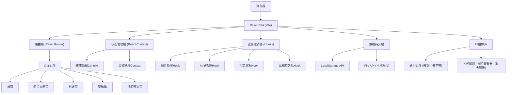

## 1. 架构设计



**架构说明**：
- 纯前端单页应用，无后端服务依赖
- 所有数据存储在浏览器LocalStorage中
- 图片仅在浏览器内存中处理，不上传服务器
- 采用React Context进行状态管理，避免过度设计
- 使用自定义Hooks封装业务逻辑，提高复用性

## 2. 技术描述

### 2.1 核心技术栈
- **前端框架**：React@18 + TypeScript
- **构建工具**：Vite@5
- **样式方案**：TailwindCSS@3
- **路由管理**：React Router@6
- **图标库**：Lucide React
- **状态管理**：React Context + useReducer
- **本地存储**：LocalStorage API

### 2.2 项目初始化
- 使用 `npm create vite@latest` 初始化React + TypeScript项目
- 安装TailwindCSS@3及相关依赖
- 配置路径别名 `@` 指向 `src` 目录
- 配置ESLint和Prettier代码规范

### 2.3 目录结构
```
src/
├── assets/              # 静态资源
├── components/          # 组件
│   ├── common/         # 通用组件
│   │   ├── Button.tsx
│   │   ├── Card.tsx
│   │   ├── Input.tsx
│   │   ├── Modal.tsx
│   │   └── Toast.tsx
│   └── business/       # 业务组件
│       ├── Navbar.tsx
│       ├── DropZone.tsx
│       ├── ImageViewer.tsx
│       ├── Magnifier.tsx
│       ├── MarkCanvas.tsx
│       ├── PatientForm.tsx
│       ├── JudgmentForm.tsx
│       └── VerificationSheet.tsx
├── context/             # 状态管理
│   ├── ReviewContext.tsx
│   └── DraftContext.tsx
├── hooks/               # 自定义Hooks
│   ├── useImageHandler.ts
│   ├── useMarkManager.ts
│   ├── useJudgment.ts
│   ├── useDraftStorage.ts
│   └── useToast.ts
├── pages/               # 页面组件
│   ├── HomePage.tsx
│   ├── ViewerPage.tsx
│   ├── JudgmentPage.tsx
│   ├── DraftPage.tsx
│   └── PrintPreviewPage.tsx
├── router/              # 路由配置
│   └── index.tsx
├── types/               # 类型定义
│   └── index.ts
├── utils/               # 工具函数
│   ├── storage.ts
│   ├── image.ts
│   └── date.ts
├── App.tsx
├── main.tsx
└── index.css
```

## 3. 路由定义

| 路由路径 | 页面组件 | 用途说明 |
|---------|----------|----------|
| `/` | HomePage | 首页，拖入图片、快速开始 |
| `/viewer/:draftId?` | ViewerPage | 图片查看页，支持draftId参数加载草稿 |
| `/judgment/:draftId` | JudgmentPage | 判定页，必须传入draftId |
| `/drafts` | DraftPage | 草稿箱页面 |
| `/print/:draftId` | PrintPreviewPage | 打印预览页 |
| `*` | HomePage | 404重定向到首页 |

## 4. 数据模型

### 4.1 核心数据类型定义

```typescript
// 患者信息
interface PatientInfo {
  studyNo: string;        // 检查号
  name: string;           // 姓名
  gender: 'male' | 'female' | '';  // 性别
  age: string;            // 年龄
  bodyPart: string;       // 检查部位
  studyDate: string;      // 检查日期
  studyTime: string;      // 检查时间
}

// 标记类型
type MarkType = 'stain' | 'shadow';  // 污点 | 阴影

// 标记数据
interface Mark {
  id: string;
  type: MarkType;
  x: number;              // 相对图片宽度的百分比位置 0-100
  y: number;              // 相对图片高度的百分比位置 0-100
  size: number;           // 标记大小（像素）
  createdAt: number;
}

// 清晰度选项
type ClarityLevel = 'clear' | 'moderate' | 'blur';

// 完整性选项
type CompletenessLevel = 'complete' | 'partial' | 'missing';

// 缺陷类型
type DefectType = 'stain' | 'shadow' | 'artifact' | 'thickness' | 'position';

// 判定结果
interface Judgment {
  clarity: ClarityLevel | '';
  completeness: CompletenessLevel | '';
  defects: DefectType[];
  rejectionReason: string;
  conclusion: 'pass' | 'fail' | '';
  reviewerName: string;
  reviewedAt: number;
}

// 图片数据
interface ImageData {
  id: string;
  name: string;
  type: string;
  size: number;
  dataUrl: string;        // base64数据
  width: number;
  height: number;
  rotation: number;       // 旋转角度 0/90/180/270
  scale: number;          // 缩放比例
  marks: Mark[];
}

// 草稿数据
interface Draft {
  id: string;
  createdAt: number;
  updatedAt: number;
  status: 'incomplete' | 'completed';
  patientInfo: PatientInfo;
  images: ImageData[];
  currentImageIndex: number;
  judgment: Judgment;
}
```

### 4.2 LocalStorage存储结构

```typescript
// 存储键名
const STORAGE_KEYS = {
  DRAFTS: 'qc_review_drafts',       // 所有草稿列表
  CURRENT_DRAFT: 'qc_current_draft', // 当前编辑草稿ID
} as const;

// 存储格式
interface StorageData {
  drafts: Draft[];
  currentDraftId: string | null;
}
```

## 5. 核心功能实现方案

### 5.1 图片处理方案
- 使用 `FileReader` API读取本地图片为base64
- 使用Canvas进行图片旋转和缩放预览
- 图片数据完全保存在内存和LocalStorage中
- 支持拖拽移动、滚轮缩放、按钮旋转

### 5.2 放大镜实现
- 悬浮层Canvas实现放大镜效果
- 鼠标位置同步，可调节放大倍数（2x-4x）
- 边缘羽化和圆形/方形窗口选项

### 5.3 标记系统
- 基于Canvas的覆盖层实现标记绘制
- 标记坐标使用百分比存储，适配不同缩放级别
- 支持撤销、清除操作
- 污点标记：红色半透明圆点
- 阴影标记：蓝色半透明方框

### 5.4 草稿持久化
- 使用 `useDraftStorage` Hook封装LocalStorage操作
- 自动保存防抖处理（3秒无操作自动保存）
- 手动保存按钮触发即时保存
- 草稿列表按更新时间倒序排列

### 5.5 判定逻辑
- 自动判定规则：
  - 清晰度为"模糊" → 不合格
  - 完整性为"严重缺失" → 不合格
  - 缺陷项≥3项 → 不合格
  - 其他情况可手动调整结论
- 预设退回短语：
  - "图像模糊，建议重拍"
  - "存在伪影，影响诊断"
  - "位置不正，需重新摆位"
  - "层厚不均，建议调整参数"

### 5.6 打印功能
- 使用浏览器原生 `window.print()` API
- 专门的打印样式 `@media print`
- A4纸张尺寸模拟
- 支持打印预览和下载为PDF（通过浏览器打印对话框）

## 6. 性能优化

### 6.1 图片优化
- 图片压缩：使用Canvas对大尺寸图片进行适度压缩后存储
- 懒加载：草稿列表中的缩略图延迟加载
- 内存管理：离开页面时清理大图片数据

### 6.2 LocalStorage优化
- 图片数据超过1MB时提示用户注意存储限制
- 草稿数量限制（最多保存20份），超出提示清理
- 定期清理30天前的旧草稿（可选）

### 6.3 渲染优化
- 使用 `React.memo` 优化重渲染
- 图片查看器使用 `requestAnimationFrame` 优化动画
- 标记绘制使用Canvas而非DOM元素
